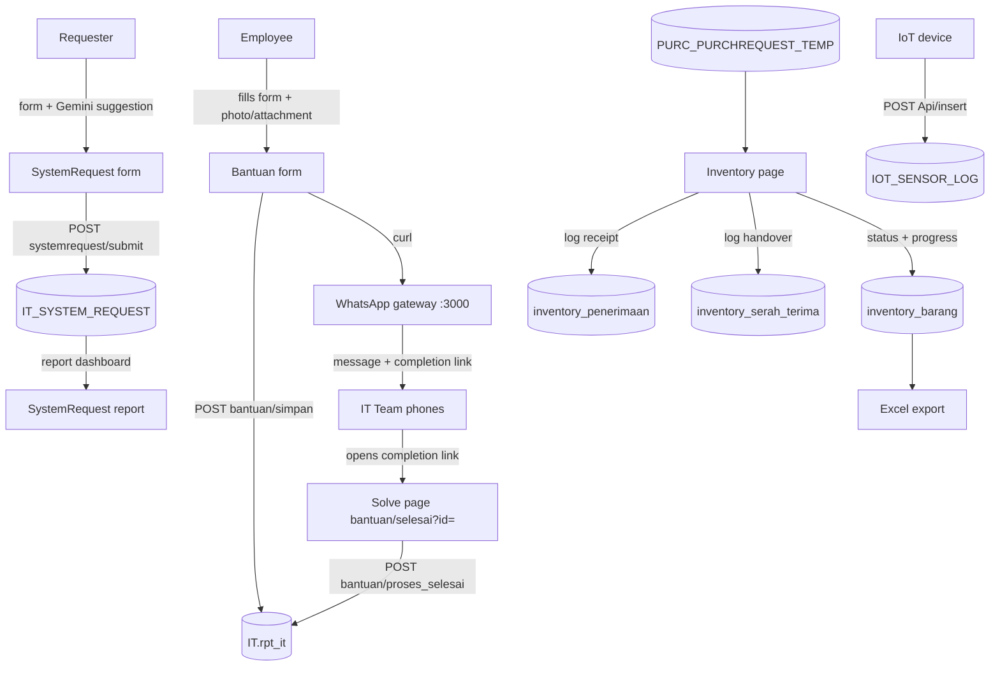
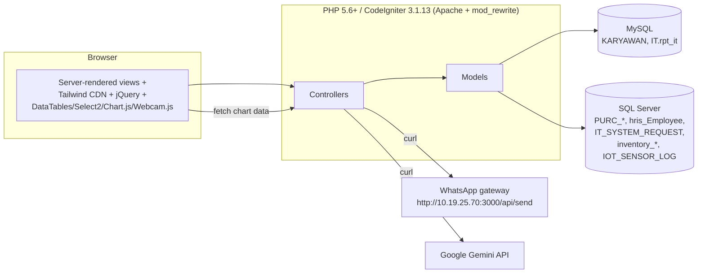

# ITSupport

> An internal IT department web application (CodeIgniter 3) for service-desk ticketing, IT system requests, IoT telemetry ingestion, and IT goods inventory tracking — from purchase-receipt through handover to end users.

Built for the IT department of **Braja Mukti Cakra** (`app.bmc.co.id`), this application consolidates several previously manual IT workflows into one PHP web app backed by **two databases** (MySQL + SQL Server) and integrates with a **WhatsApp gateway** and the **Google Gemini API**.

---

## Table of Contents

- [Overview](#overview)
- [What This Project Does](#what-this-project-does)
- [Problem](#problem)
- [Solution](#solution)
- [How It Works](#how-it-works)
- [System Architecture](#system-architecture)
- [Data Flow](#data-flow)
- [Key Features](#key-features)
- [Technology Stack](#technology-stack)
- [Project Structure](#project-structure)
- [Authentication & Authorization](#authentication--authorization)
- [API Overview](#api-overview)
- [Database](#database)
- [External Services & Integrations](#external-services--integrations)
- [Implementation Overview](#implementation-overview)
- [Environment & Configuration](#environment--configuration)
- [Installation & Setup](#installation--setup)
- [Running the Project](#running-the-project)
- [Testing](#testing)
- [Deployment](#deployment)
- [Security Considerations](#security-considerations)
- [Limitations / Known Issues](#limitations--known-issues)
- [Future Improvements](#future-improvements)
- [Author](#author)
- [License](#license)

---

## Overview

ITSupport is a **server-rendered PHP web application (CodeIgniter 3.1.13)** that replaces manual/siloed IT workflows with four functional areas:

| Area | Purpose |
| --- | --- |
| **Dashboard** | KPIs and charts over IT support tickets (`IT.rpt_it`). |
| **Bantuan (Helpdesk)** | Employees report IT problems; a photo/attachment can be captured with a webcam; IT is notified via WhatsApp; tickets are closed through a completion link. |
| **System Request** | A standalone form + report dashboard for requesting new/internal IT systems, including an AI-suggestion feature powered by Google Gemini. |
| **Inventory Barang** | Tracks procurement items (PR = purchase request) for the IT department through *receiving* and *handover to users*, with filtering, status computation, and Excel export. |

It also exposes a small **JSON API** used for the dashboard chart and for **IoT sensor telemetry ingestion**.

The application is in Indonesian and is intended for internal company use. All UI text and labels are Indonesian.

---

## What This Project Does

1. **IT Helpdesk ticketing**
   - A staff member selects their name, describes a problem, optionally attaches a file or takes a photo with the browser webcam, and submits.
   - On submit the system inserts a ticket into `IT.rpt_it` and pushes a WhatsApp message (with a *completion link*) to a hardcoded list of IT phone numbers.
   - The completion link opens a *solve* page where an IT PIC records the repair type, the PIC, and a solution summary; the ticket is then marked done.

2. **IT system request pipeline**
   - A standalone form lets anyone request a new IT system: requester info (auto-filled from the HR employee list via select2/AJAX), problem statement, proposed solution, before/after conditions, UI preference, and expected data output.
   - A *"Tanya AI"* button sends the problem text to **Google Gemini** (`gemini-flash-lite-latest`) and returns a suggested solution + data-output recommendation that can be copied into the form.
   - Submissions are stored in `IT_SYSTEM_REQUEST` (SQL Server). A dark-themed report dashboard shows KPIs (pending / in process / done), status distribution, requests per department, a 6-month trend, and per-programmer workload. Tickets can be assigned to an IT staff member and printed as a printable report.

3. **Inventory tracking (procurement → handover)**
   - Reads PR line items from the procurement data (SQL Server tables `PURC_PURCHREQUEST_TEMP`, `PURC_MATCATALOG`, `PURC_BIDPR`) for department `0800` and PR numbers of the current year (suffix `26`).
   - A local tracking row is auto-created in `inventory_barang` when a first receipt is logged.
   - **Penerimaan Barang** (receiving): partial receipts are logged in `inventory_penerimaan`; qty is validated against the PR total and the effective status (`Menunggu Barang` → `Stock IT` → `Sudah Diserahkan ke User`) is recomputed.
   - **Serah Terima ke User** (handover): stock held by IT is handed to employees and recorded in `inventory_serah_terima`; validation prevents handing over more than was received.
   - The main page groups items by PR number with progress bars, filters, a DataTables-based receiving/handover history, and **Excel export**.

4. **IoT telemetry ingestion**
   - `POST Api/insert` accepts JSON `{device_id, temperature, voltage, alarm_status}` and stores a row in `IOT_SENSOR_LOG` (SQL Server). No IoT hardware/simulator code is included in this repository.

---

## Problem

- IT support requests were handled ad-hoc (phone/Walkie-Talkie/chat), without a governed trail of tickets, PIC assignment, or completion status.
- There was no structured way for departments to request *new* IT systems, or to track their status and workload.
- IT goods procurement (PRs) had no visibility between **ordered → received → handed over to the requester**; there was no shared record of partial receipts or who received what.
- No centralized dashboard to answer "how many requests are open/pending/done" or to review per-programmer load.
- No automated notification path that told the IT team immediately about a new trouble ticket.

---

## Solution

- A single **CodeIgniter 3** application with HTTP endpoints served by Apache (mod_rewrite) for: ticketing, the acknowledgment/completion flow, the system-request form with its report dashboard, and the inventory lifecycle.
- **Two data sources** are connected at once:
  - a **MySQL** connection (`default`) used by the helpdesk/dashboard (`IT.rpt_it`, `KARYAWAN`, `hc.KARYAWAN`);
  - a **SQL Server** connection (`sqlServer`, PDO `sqlsrv`) used by procurement (`PURC_*`), HRIS (`hris_Employee`, `MASCOSTCENTER`), the system-request table, IoT logs, and the inventory tracking tables.
- Inventory status/progress is **derived from quantities** (received vs. ordered, handed-over vs. received) rather than trusting a manually kept flag, so the UI self-heals when receipts/handovers are edited or deleted.
- **WhatsApp gateway** integration notifies the IT team with a completion link, closing the loop between report and resolution.
- **Google Gemini** integration assists requesters with solution/data-output suggestions.

---

## How It Works

### Product Flow



### System Architecture



### Data Flow

```text
Helpdesk ticket:
  Browser (form + webcam)  -->  Bantuan::simpan  -->  IT.rpt_it (MySQL)
                                                    -->  WhatsApp gateway  -->  IT team phones
  IT team (completion link) -->  Bantuan::selesai / ::proses_selesai  -->  IT.rpt_it updated (report2, dt=1)

Inventory:
  PURC_PURCHREQUEST_TEMP + PURC_MATCATALOG + PURC_BIDPR  -->  InventoryBarang_model  -->  Inventory page (grouped by PR)
  Receiving form  -->  simpan_penerimaan  -->  inventory_penerimaan (+ auto-create inventory_barang, recompute status)
  Handover form   -->  simpan_serah_terima --> inventory_serah_terima  (recompute status)
  Excel export    -->  export_excel / export_excel_simple

System request:
  Select2 (get_employees) + "Tanya AI" (ask_ai -> Gemini) --> submit --> IT_SYSTEM_REQUEST (SQL Server)
  update_status / cetak_laporan  ->  report dashboard

IoT:
  JSON POST  -->  Api::insert  -->  Iot_model  -->  IOT_SENSOR_LOG (SQL Server)

Dashboard:
  M_dashboard queries  -->  IT.rpt_it / KARYAWAN (MySQL)  -->  KPI cards + Chart.js (calling per month via Api::callApi)
```

---

## Key Features

### Helpdesk (Bantuan)

- Employee report form with employee dropdown, problem description, location, optional file attachment, and live webcam capture (Webcam.js).
- Automatic insertion into `IT.rpt_it` (ticket number, dept, date/time, photo, attachment).
- Automatic WhatsApp notification with a per-ticket completion link to a fixed list of IT phone numbers.
- Ticket completion page with PIC selection, repair-type dropdown, and solution notes; success screen afterwards (`terimaKasih`).

### System Request

- Standalone multi-section form with AJAX-backed employee search (Select2) for requester auto-fill.
- AI suggestion ("Tanya AI") via Google Gemini that proposes a solution and expected data output, with a "copy to Solusi" action.
- Submission persisted to `IT_SYSTEM_REQUEST` with SweetAlert feedback.
- Report dashboard (dark theme): KPI cards, status doughnut, requests-per-department bar, 6-month trend line, programmer performance cards, and an assign-IT workflow that prevents assigning a programmer who is already busy.
- Printable per-ticket report page (`cetak_laporan`).

### Inventory Barang

- Grouped-by-PR inventory table with expand/collapse, per-PR and per-item progress bars, and derived status.
- Filters: status, recipient user, PR number, item name, receipt date range; plus a free-text search.
- **Penerimaan (receiving):** add/edit/delete partial receipts with qty-vs-PR-total validation; inventory row auto-created on first receipt; status recomputed (`Menunggu Barang` / `Stock IT` / `Sudah Diserahkan ke User`).
- **Serah Terima (handover):** add/edit/delete handovers to employees with qty vs. received validation; busy/QC safeguards.
- Excel export via **PHPExcel** (`.xlsx`, multi-sheet, grouped by status) with a simple HTML `.xls` fallback endpoint.
- Server-side form validation (CI `form_validation`) on all write endpoints.

### Dashboard

- KPI cards: total requests, done, pending, active employees.
- "Calling Per Month" bar chart (Chart.js) fed by `Api::callApi`.
- Latest requests table (last 5) with pending/done badges (DataTables).

### API / IoT

- `GET Api/callApi` — JSON monthly ticket counts for the dashboard chart.
- `POST Api/insert` — IoT telemetry ingestion (`device_id`, `temperature`, `voltage`, `alarm_status`) with JSON validation and error responses.

---

## Technology Stack

| Layer | Technology | Verified from |
| --- | --- | --- |
| Framework | CodeIgniter 3.1.13 (PHP) | `system/core/CodeIgniter.php` |
| Language | PHP (>= 5.3.7 declared; PHP 8.3 CLI present locally) | `composer.json`, local environment |
| Frontend | Server-rendered PHP views + Tailwind CSS (CDN v4), Daisy UI, jQuery 3.7.1, Select2 4.1.0-rc.0, DataTables 1.13.x, Chart.js, SweetAlert2, Webcam.js | `application/views/templates/header.php`, `footer.php` |
| Database 1 | MySQL (`default` connection, `mysqli`) | `application/config/database.example.php` |
| Database 2 | Microsoft SQL Server (`sqlServer`, PDO `sqlsrv`) | `application/config/database.example.php`, model/controller usage |
| Excel export | PHPExcel (deprecated) via composer `vendor/autoload.php` | `InventoryBarang::export_excel()` |
| AI | Google Gemini API (`gemini-flash-lite-latest`) | `SystemRequest::ask_ai()` |
| Messaging | Internal WhatsApp gateway (HTTP JSON `POST` to `http://10.19.25.70:3000/api/send`) | `Bantuan::simpan()` |
| Web server | Apache + `mod_rewrite` (`.htaccess`) | `.htaccess`, `index.php`, `config.php` |

> Versions marked "CDN" are hard-pinned in the views; framework versions are pinned in source. No lockfile exists (`package-lock.json` is gitignored and not present).

---

## Project Structure

```text
ITSupport/
├── application/
│   ├── cache/                  # CI cache (empty)
│   ├── config/
│   │   ├── config.php          # Base URL, session, security flags
│   │   ├── database.example.php# DB connection template (copy to database.php)
│   │   ├── routes.php          # URL routing
│   │   └── ...                 # standard CI3 config files
│   ├── controllers/
│   │   ├── Api.php             # Chart data + IoT ingestion
│   │   ├── Bantuan.php         # Helpdesk ticketing + WhatsApp
│   │   ├── Dashboard.php       # Home page KPIs
│   │   ├── InventoryBarang.php # Inventory lifecycle + Excel export
│   │   ├── SystemRequest.php   # System request form + report + Gemini
│   │   └── terimaKasih.php     # Success/thank-you page
│   ├── core/                   # empty (no MY_ overrides)
│   ├── helpers/                # empty
│   ├── hooks/                  # empty
│   ├── libraries/              # empty (stock CI3 libraries)
│   ├── logs/                   # empty (index.html only)
│   ├── models/
│   │   ├── Iot_model.php           # INSERT into IOT_SENSOR_LOG
│   │   ├── InventoryBarang_model.php # PR joins + inventory/penerimaan/serah-terima
│   │   └── M_dashboard.php         # Dashboard counts
│   ├── third_party/            # empty
│   └── views/
│       ├── bantuan/            # helpdesk form + solve page
│       ├── dashboard.php
│       ├── inventory_barang/   # index + legacy (tambah/edit/detail)
│       ├── SystemRequest/      # form, report dashboard, print report
│       ├── templates/          # header/sidebar/footer (shared CDN assets)
│       └── terimaKasih.php
├── assets/img/                 # static images (temen.jpeg used by terimaKasih)
├── system/                     # CodeIgniter 3.1.13 framework core
├── .gitignore                  # excludes database.php, .env, uploads/, *.sql, logs
├── .htaccess                   # rewrite all requests to index.php
├── composer.json               # CI3 framework (phpunit/vfsstream dev)
├── index.php                   # CI3 front controller
├── license.txt                 # MIT (CodeIgniter)
├── readme.rst                  # stock CodeIgniter readme (stale boilerplate)
├── tailwind.config.js          # empty placeholder
└── README.md                   # this file
```

| Directory / File | Responsibility |
| --- | --- |
| `application/controllers/` | HTTP endpoints; one class per module. |
| `application/models/` | Database access. `InventoryBarang_model` is the largest and drives the inventory module. |
| `application/views/` | Server-rendered pages. `templates/` holds the shared layout + CDN assets. |
| `application/config/` | Routing, database connections (template), app settings. |
| `system/` | Unmodified CodeIgniter 3.1.13 core. |
| `assets/img/` | Static images. |

---

## Authentication & Authorization

> Status: **Not implemented.**

- There is **no login, session-guard, role system, or authorization middleware** anywhere in the codebase.
- Every controller method is publicly reachable via CodeIgniter's default `controller/method` routing:
  - Anyone can submit helpdesk tickets, close tickets (`bantuan/proses_selesai`), submit system requests, change ticket status (`systemrequest/update_status`), and post IoT telemetry.
- Sessions are used only for one-off flash messages (SweetAlert feedback), not for access control.
- CSRF protection is disabled (`config.php`: `csrf_protection = FALSE`), `global_xss_filtering = FALSE`, and there is no input sanitization library beyond CI's default `input` class and the `form_validation` rules used on the inventory write endpoints.

---

## API Overview

There is no formal REST API layer; these are plain CodeIgniter controller methods returning JSON. Endpoints reachable under the default routing (plus the explicit aliases in `routes.php`):

### Helpdesk / Dashboard

| Method | Endpoint | Purpose |
| --- | --- | --- |
| GET | `/` , `/dashboard` | Dashboard page (KPIs + chart + latest requests) |
| GET | `/bantuan` | Helpdesk report form |
| POST | `/bantuan/simpan` | Create ticket + send WhatsApp notifications (JSON) |
| GET | `/bantuan/selesai?id=NNN` | Ticket completion page (public link) |
| POST | `/bantuan/proses_selesai` | Mark ticket done with PIC / repair type / notes |
| GET | `/terimaKasih` | Thank-you page after completion |

### System Request

| Method | Endpoint | Purpose |
| --- | --- | --- |
| GET | `/systemrequest` | Request form |
| POST | `/systemrequest/submit` | Insert `IT_SYSTEM_REQUEST` |
| GET | `/systemrequest/get_employees?searchTerm=` | Select2 employee search (SQL Server HRIS) |
| POST | `/systemrequest/ask_ai` | Gemini suggestion for a problem text |
| GET | `/systemrequest/cek_model` | Debug: list Gemini models (exposes API key) |
| GET | `/systemrequest/report` | Report dashboard |
| GET | `/systemrequest/update_status/{id}/{status}` | Change ticket status (`Proses`/`Selesai`), assigned IT via `?it_id=` |
| GET | `/systemrequest/cetak_laporan/{id}` | Printable per-ticket report |
| GET | `/systemrequest/get_employeesItSupport?searchTerm=` | List assignable IT staff |
| GET | `/systemrequest/get_ProgrammerKerja?ditangani_oleh=` | Is this programmer already busy? |

### Inventory Barang

| Method | Endpoint | Purpose |
| --- | --- | --- |
| GET | `/inventorybarang` | Main inventory page (3 tabs) |
| GET | `/inventorybarang/penerimaan_list` | Receiving history (JSON, DataTables) |
| GET | `/inventorybarang/inventory_dropdown` | PR/item dropdown (JSON) |
| GET | `/inventorybarang/inventory_dropdown_serah_terima` | Stock-IT items with remaining qty (JSON) |
| GET | `/inventorybarang/employee_dropdown?search=` | Active employees for handover (JSON) |
| GET | `/inventorybarang/penerimaan_detail/{id}` | Single receiving row (JSON) |
| POST | `/inventorybarang/simpan_penerimaan` | Create receiving record |
| POST | `/inventorybarang/update_penerimaan/{id}` | Update receiving record |
| POST | `/inventorybarang/hapus_penerimaan/{id}` | Delete receiving record |
| GET | `/inventorybarang/serah_terima_list` | Handover history (JSON) |
| GET | `/inventorybarang/serah_terima_detail/{id}` | Single handover row (JSON) |
| POST | `/inventorybarang/simpan_serah_terima` | Create handover record |
| POST | `/inventorybarang/update_serah_terima/{id}` | Update handover record |
| POST | `/inventorybarang/hapus_serah_terima/{id}` | Delete handover record |
| GET | `/inventorybarang/export_excel` | Excel `.xlsx` export (PHPExcel) |
| GET | `/inventorybarang/export_excel_simple` | Fallback HTML `.xls` export |

### IoT / Charts

| Method | Endpoint | Purpose |
| --- | --- | --- |
| GET | `/api/callapi` | Monthly ticket counts (JSON) for the dashboard chart |
| POST | `/api/insert` | IoT telemetry ingestion (JSON) into `IOT_SENSOR_LOG` |

### 🔴 Broken routes (defined but target methods do not exist)

Defined in `routes.php` but the corresponding methods were removed from `InventoryBarang`:

| Route | Targets missing method |
| --- | --- |
| `/inventorybarang/tambah` | `InventoryBarang::tambah` |
| `/inventorybarang/simpan` | `InventoryBarang::simpan` |
| `/inventorybarang/edit/{id}` | `InventoryBarang::edit` |
| `/inventorybarang/update/{id}` | `InventoryBarang::update` |
| `/inventorybarang/hapus/{id}` | `InventoryBarang::hapus` |
| `/inventorybarang/detail/{id}` | `InventoryBarang::detail` |
| `/inventorybarang/lihat/{id}` | `InventoryBarang::lihat` |

All of the above produce a 404. See [Limitations / Known Issues](#limitations--known-issues).

---

## Database

Two connections are configured (template in `application/config/database.example.php`; the real `application/config/database.php` is gitignored and **not** present in this repository):

| Connection key | Driver (template) | Host-style | Used by |
| --- | --- | --- | --- |
| `default` | `mysqli` | MySQL | Helpdesk/dashboard: `KARYAWAN`, `hc.KARYAWAN`, `IT.rpt_it` |
| `sqlServer` | `pdo` (`sqlsrv:Server=...;Database=...`) | SQL Server | Procurement `PURC_*`, HRIS `hris_Employee`/`MASCOSTCENTER`, `IT_SYSTEM_REQUEST`, `IOT_SENSOR_LOG`, `inventory_barang`/`inventory_penerimaan`/`inventory_serah_terima` |

### Owned tables (schema created outside this repo — see note below)

**`inventory_barang`** — one tracking row per PR+material for the IT department.

| Field | Notes |
| --- | --- |
| `id` | PK |
| `no_pr`, `material_id` | Keyed against `PURC_PURCHREQUEST_TEMP` (join uses `RTRIM(...) COLLATE DATABASE_DEFAULT`) |
| `nama_barang`, `qty`, `no_mrp`, `nama_user`, `toko` | Item details |
| `status` | `Menunggu Barang` / `Sudah Diterima IT` / `Sudah Diserahkan ke User` |
| `tanggal_pr`, `tanggal_terima`, `tanggal_diserahkan`, `keterangan` | Timeline + notes |
| `created_at`, `updated_at` | Timestamps |

**`inventory_penerimaan`** — partial receipt rows (FK `inventory_id → inventory_barang.id`).

**`inventory_serah_terima`** — handover rows (FK `inventory_id → inventory_barang.id`).

**`IT_SYSTEM_REQUEST`** — system-request tickets: `id`, `nama_peminta`, `nip_peminta`, `departemen_peminta`, `kontak_peminta`, `masalah`, `solusi`, `kondisi_before`, `kondisi_after`, `preferensi_ui`, `kebutuhan_data_output`, `status` (`Pending`/`Proses`/`Selesai`), `ditangani_oleh` (→ `hris_Employee.NIP`), `tanggal_permintaan`, `tanggal_diproses`, `tanggal_selesai`.

**`IOT_SENSOR_LOG`** — `device_id`, `temperature`, `voltage`, `alarm_status`, `created_at`.

**`IT.rpt_it`** (MySQL) — helpdesk tickets: `id`, `NONIK` (→ `KARYAWAN.NONIK`), `KODEF` (dept), `report`, `lokasi`, `gambar` (photo), `tgl`, `time`, `gambar3` (attachment), `gambar2` (PIC `NONIK`), `device` (repair type), `report2` (solution), `tgl2`, `time2`, `dt` (done flag).

### External/read-only tables referenced

- `PURC_PURCHREQUEST_TEMP` (PRNo, MaterialId, Qty, CDate, Dept) — department `0800`, year suffix `26`.
- `PURC_MATCATALOG` (Materialid, MaterialName) — item names (may be `;`-separated, split via SQL `OPENJSON`).
- `PURC_BIDPR` (PRNo, MaterialId, BidNo).
- `hris_Employee` (NIP, Name, DepartID, is_Active, Id_Employee).
- `MASCOSTCENTER` (DepartID, NamaDepartemen).
- `KARYAWAN` / `hc.KARYAWAN` (NONIK, NM_KAR, KODEF, KELUAR / `keluar`).

### Relationships

```mermaid
erDiagram
    INVENTORY_BARANG ||--o{ INVENTORY_PENERIMAAN : "receives"
    INVENTORY_BARANG ||--o{ INVENTORY_SERAH_TERIMA : "hands over"
    PURC_PURCHREQUEST_TEMP ||--o{ INVENTORY_BARANG : "tracked by (no_pr, material_id)"
    HRIS_EMPLOYEE ||--o{ IT_SYSTEM_REQUEST : "handles (NIP)"
    KARYAWAN ||--o{ IT_RPT_IT : "reports (NONIK)"
    INVENTORY_BARANG {
        int id PK
        string no_pr
        string material_id
        string nama_barang
        int qty
        string status
    }
    INVENTORY_PENERIMAAN {
        int id PK
        int inventory_id FK
        date tanggal_diterima
        int qty_diterima
    }
    INVENTORY_SERAH_TERIMA {
        int id PK
        int inventory_id FK
        string nama_user
        int qty_diserahkan
        date tanggal_serah
    }
    IT_SYSTEM_REQUEST {
        int id PK
        string status
        string ditangani_oleh FK
    }
    IT_RPT_IT {
        int id PK
        string NONIK FK
        text report
        text report2
    }
```



> Accurate as of today's date. Field names above are exactly those referenced in queries; the physical DDL lives in the target databases and is **not versioned in this repository**.

### Migrations & seeders

- No migration framework files, no seeder, and no `.sql` dump are present.
- CI3 migrations are disabled (`migration.php`: `migration_enabled = FALSE`).
- The inventory tables are created/updated directly by the models (an `inventory_barang` row is auto-created on the first receipt via `find_or_create_inventory`).

---

## External Services & Integrations

| Integration | What it does | Where | Config required |
| --- | --- | --- | --- |
| **WhatsApp gateway** | Sends ticket notifications with completion links to a fixed list of IT numbers. | `Bantuan::simpan()` (`controllers/Bantuan.php`) via cURL `POST http://10.19.25.70:3000/api/send` `{no, text}` | **Hardcoded** (gateway URL + recipient numbers). No config file. |
| **Google Gemini API** | Suggests solutions/data-output based on the problem text; list models on a debug page. | `SystemRequest::ask_ai()` and `::cek_model()` via cURL to `generativelanguage.googleapis.com` | **Hardcoded API key** in source. ⚠️ See Security. |
| **SQL Server (BMC/HRIS/procurement)** | Authoritative source for PR data, employee data, cost centers. | `InventoryBarang_model`, `SystemRequest`, `Iot_model` | `sqlServer` connection in `database.php`. |
| **MySQL (helpdesk/HR master)** | Helpdesk tickets and employee master. | `M_dashboard`, `Bantuan` | `default` connection in `database.php`. |

There is **no** MQTT, queue/worker daemon, cron job, or WebSocket in this repository. The IoT integration is a plain HTTP POST endpoint only.

---

## Implementation Overview

Verifiable from the repository's structure and commit history (2 commits on `main`):

1. **Bootstrap** — CodeIgniter 3.1.13 with a trimmed `application/` tree; base URL set to the production domain `https://app.bmc.co.id/itSupport/`.
2. **Helpdesk + dashboard** — `Bantuan`, `Dashboard`, `M_dashboard`, `Api::callApi` against the MySQL side (`IT.rpt_it`, `KARYAWAN`); webcam uploads plus WhatsApp notifications.
3. **System Request pipeline** — `SystemRequest` controller + three views (form, dark report dashboard, printable report) against SQL Server, with the Gemini integration.
4. **IoT ingestion** — `Api::insert()` + `Iot_model` writing `IOT_SENSOR_LOG`.
5. **Inventory lifecycle (most recent work)** — `InventoryBarang` was reworked from a straight CRUD (the older `tambah/edit/detail` views and routes remain as leftovers) into the current PR-grouped dashboard with `inventory_penerimaan`/`inventory_serah_terima` sub-tables and derived statuses, plus Excel export (added in commit `84399a7`).

---

## Environment & Configuration

The project has **no `.env` file mechanism** (`.gitignore` reserves `.env*`, but there is no `.env.example` file and no library reads environment variables). All configuration is plain PHP:

| File | Responsibility | Notes |
| --- | --- | --- |
| `application/config/database.php` | DB credentials for `default` (MySQL) and `sqlServer` (SQL Server) | **Not in repo** — copy from `database.example.php` |
| `application/config/config.php` | Base URL, session, cookies, CSRF, logging, timezone | `base_url` is hardcoded to production; timezone `Asia/Jakarta` |
| `index.php` | `ENVIRONMENT` via `$_SERVER['CI_ENV']` (`development` default) | Set server env `CI_ENV=production` to hide errors |
| `application/config/routes.php` | Route aliases + default controller | Contains legacy broken routes |

| Setting | Value (as shipped) |
| --- | --- |
| `base_url` | `https://app.bmc.co.id/itSupport/` |
| `timezone` | `Asia/Jakarta` |
| `log_threshold` | 4 (everything) |
| `csrf_protection` | `FALSE` |
| `encryption_key` | empty |
| `sess_driver` / expiry | `files` / 7200s |
| `composer_autoload` | `FCPATH . 'vendor/autoload.php'` |

There is no `database.example.php` secret risk: it only contains placeholders (`YOUR_HOST`, `YOUR_USERNAME`…). Real credentials live in the gitignored `database.php`.

---

## Installation & Setup

### Prerequisites

- **PHP 5.6+** (CodeIgniter 3.1.13; tested locally on PHP 8.3). Extensions required in practice: `mysqli`, `pdo_sqlsrv` (SQL Server driver — must be installed separately), `curl`, `json`, `mbstring`.
- **Apache** with `mod_rewrite` (or Nginx with a rewrite equivalent), pointing `DocumentRoot` at the project root.
- **Two databases**:
  - MySQL (helpdesk: `KARYAWAN`, `IT.rpt_it` tables).
  - Microsoft SQL Server (procurement/HRIS/inventory tables).
- **Composer** only if you want the real Excel `.xlsx` export (installs PHPExcel via `vendor/`).
- Node.js is **not** required — all front-end libraries come from CDNs.

### Steps

```bash
# 1. Clone
git clone https://github.com/HidayahMF/ITSupport.git
cd ITSupport

# 2. Configure the database (REQUIRED)
cp application/config/database.example.php application/config/database.php
#    → fill in: default  = MySQL connection
#              sqlServer = SQL Server connection (sqlsrv:Server=...;Database=...)

# 3. (Optional) Composer dependencies for the Excel export
composer install

# 4. Point your web server at the project root and ensure:
#    - application/logs, application/cache are writable
#    - the SQL Server PDO driver (pdo_sqlsrv) is enabled for PHP
#    - CI_ENV (server env) selects the environment (development/testing/production)
```

### Database setup

There are **no migrations or seeders** in the repository. The required tables (`inventory_barang`, `inventory_penerimaan`, `inventory_serah_terima`, `IOT_SENSOR_LOG`, `IT_SYSTEM_REQUEST`, helpdesk tables, etc.) must already exist in their target databases and match the field names referenced in section [Database](#database). This schema is not versioned.

---

## Running the Project

Because this is a single PHP application (no build step), "running" it is simply serving the project root. Example with PHP's built-in server for quick local checks (Apache/Nginx is required for production use):

```bash
# Terminal 1 – PHP built-in server (development only)
php -S localhost:8000
# then open http://localhost:8000/
```

- The application expects a `base_url` trailing-slash config; for a local run, change `base_url` in `application/config/config.php` to your local URL (e.g. `http://localhost:8000/`).
- The dashboard chart script (`templates/footer.php`) fetches `https://app.bmc.co.id/itSupport/Api/callAPi` **hardcoded** — on a non-production host it will still hit production (see Known Issues).
- There are no background workers, queues, or scheduled jobs.

---

## Testing

> Status: **No automated tests in this repository.**

- No `tests/` directory is present.
- `composer.json` carries the stock CodeIgniter dev dependencies (`phpunit`, `vfsstream`) and the default `test:coverage` Composer script, but no application tests exist.
- No linting/CI scripts. PHP syntax was not CI-validated in this repo.
- The application was evidently validated manually during development (PHP 8.3 CLI is available locally); API endpoints have never been exercised by automated tests.

---

## Deployment

> Status: **No production deployment automation in the repository.**

- There is **no** `Dockerfile`, `docker-compose.yml`, GitHub Actions workflow, or any CI/CD configuration.
- The only server-related artifact is the Apache `.htaccess` (mod_rewrite to `index.php`).
- The app is (per `config.php`) deployed to `https://app.bmc.co.id/itSupport/` on an internal Apache + PHP host — this is configured **inside the app code**, not via environment.
- Deployment is evidently manual (copy files + configure `database.php`).

An inferred production setup would be: Apache vhost with `DocumentRoot` → project root, `CI_ENV=production` set, `application/logs` + `uploads/` writable, PHP with `pdo_sqlsrv`, and `.htaccess` rewrites enabled.

---

## Security Considerations

Reviewed security properties and issues found in the code:

- 🔴 **Hardcoded Google Gemini API key in source.** `SystemRequest.php` lines 81 and 107 contain a live-looking API key. Because the repository is public on GitHub, this key must be considered compromised: **revoke it** in Google Cloud, then move it to a gitignored config/`.env`/key-file and read it at runtime.
- 🔴 **No authentication / authorization / CSRF protection on any endpoint.** Tickets, ticket closure, status changes, AI calls, and IoT ingestion are all unauthenticated. `csrf_protection = FALSE`, `global_xss_filtering = FALSE`, `encryption_key` empty, `cookie_secure = FALSE`.
- 🔴 **Hardcoded internal WhatsApp gateway URL and recipient phone numbers** (`Bantuan.php`). Hardcoded credentials/infrastructure details are committed to a public repo.
- 🟡 **Dangerous cURL settings:** `CURLOPT_SSL_VERIFYPEER => false` in `SystemRequest` calls; the WhatsApp request uses `http://` (plaintext) with no auth token.
- 🟡 **Unrestricted file uploads:** `Bantuan::simpan` trusts the browser filename and writes base64 data as `.jpg` with no MIME/size validation; directories created with `0777`. `uploads/` is web-accessible (`FCPATH . 'uploads/...'` served via `base_url` in the ticket view).
- 🟡 **Debug endpoint exposure:** `SystemRequest::cek_model()` prints the Gemini model list and is reachable by anyone.
- 🟡 **Verbose behavior:** `log_threshold = 4`, `db_debug` depends on ENVIRONMENT, and model code logs full insert payloads/query strings at error level (see `InventoryBarang_model::insert`), which can be noisy/leaky in shared log files.
- 🟡 Legacy views/endpoints (`detail`, `edit`, `tambah`) render raw POST data without output escaping in places, though the inventory forms use `htmlspecialchars` on PHP-rendered values.

---

## Limitations / Known Issues

Compiled from the code audit. Status: 🟢 working · 🟡 partial / needs attention · 🔴 broken / missing.

### 🔴 Critical

1. **Hardcoded Google AI key committed to a public repo.**
   - *Where:* `application/controllers/SystemRequest.php` (lines 81, 107).
   - *Impact:* Anyone with repo access can use/charge the API key. 
   - *Fix:* Revoke the key; read it from a gitignored config file/env at runtime; remove `cek_model()` or make it admin-only.
   
2. **Legacy inventory routes/views point to non-existent controller methods.**
   - *Where:* `application/config/routes.php` (`tambah`, `simpan`, `edit`, `update`, `hapus`, `detail`, `lihat`) and `application/views/inventory_barang/tambah.php` (posts to `/inventorybarang/simpan`), plus the `lihatDetail()` JS in `index.php` calling `/inventorybarang/detail/{id}`.
   - *Impact:* Visiting or submitting those URLs returns 404 / no such method. The old CRUD UI (`tambah.php`, `edit.php`, `detail.php`) is orphaned and unreachable from the current navigation.
   - *Fix:* Delete the legacy routes/views, or re-implement the intended methods.

3. **`terimaKasih.php` references an undefined JS variable.**
   - *Where:* `application/views/terimaKasih.php` — `const imgSrc = ...` is commented out (line 63) but `img.src = imgSrc` (line 67) is used.
   - *Impact:* `ReferenceError: imgSrc is not defined`; the floating-image animation never renders.
   - *Fix:* Uncomment/restore the `imgSrc` assignment, or guard the call.

### 🟡 High / partial

4. **Excel export requires unsupported / absent PHPExcel.**
   - *Where:* `InventoryBarang::export_excel()` (`require_once APPPATH . '../vendor/autoload.php'`; `new PHPExcel()`).
   - *Impact:* Fails with a fatal error unless `composer install` was run and PHPExcel somehow loads under the target PHP (PHPExcel is **abandoned**; does not support modern PHP). The UI links only to this endpoint.
   - *Fix:* Either commit/install PHPExcel (frameworks like PhpSpreadsheet are the maintained successor), or switch the UI button to the working fallback `export_excel_simple`.

5. **`update_penerimaan` may call `get_qty_from_pr()` with the wrong argument.**
   - *Where:* `InventoryBarang::update_penerimaan()` line 366 passes `$inv['nama_barang']` (a name) as the `$material_id` parameter.
   - *Impact:* `get_qty_from_pr($no_pr, $nama_barang)` matches no `MaterialId`, returns `0`, and the "qty exceeds remaining" validation on edits can therefore be wrong (blocks or allows incorrect quantities). `simpan_serah_terima` and `hapus_penerimaan` correctly pass `material_id`.
   - *Fix:* Pass `$inv['material_id']` in `update_penerimaan`.

6. **Hardcoded production base URL inside the application and views.**
   - *Where:* `application/config/config.php` and `application/views/templates/footer.php` (chart fetch).
   - *Impact:* Any local/staging deployment still charts against production unless edited by hand; the fetch in `footer.php` ignores `base_url()`.
   - *Fix:* Use `base_url()` in the footer fetch; make `base_url` env-driven.

7. **No authentication/authorization and disabled CSRF.**
   - *Impact:* Any internal user (or network attacker) can create/close tickets, change system-request statuses, call the AI feature, or write IoT records; no audit trail of who performed an action.
   - *Fix:* Add a login (CI3 session-based), role checks, and enable CSRF for form endpoints (adjust the JS AJAX calls accordingly).

8. **Inventory data hard-filtered to department `0800` and year `26`.**
   - *Where:* `InventoryBarang_model` (multiple queries use `a.Dept = '0800'` and `RIGHT(PRNo,2) = '26'`).
   - *Impact:* The feature is year-specific by design today; it will silently stop showing rows when the PR numbering year changes and cannot serve other departments.
   - *Fix:* Externalize the department/year into configuration.

9. **`inventory_barang.tanggal_pr` is set to the creation timestamp instead of the real PR date.**
   - *Where:* `find_or_create_inventory()`.
   - *Impact:* Lead-time ("Tanggal Terima − Tanggal PR") and the date column are inaccurate for auto-created rows.
   - *Fix:* Copy `CDate`/`tanggal_pr` from the PR source on creation.

### 🟡 Low / cleanup

10. **Uploads directory handling is permissive** (base64 `.jpg`, no type/size check, `0777` dirs, filenames based on `time()`). *See Security.*

11. **SQL `OPENJSON`-based name splitting** (`.inventory` queries) needs SQL Server 2016+; the code comment says SQL Server 2022. Not portable to other DBs.

12. **`M_dashboard::jumlahKaryawan()` counts all of `KARYAWAN`** while the ticket form's employee list (`getKaryawan()`) filters `keluar = 0` — the dashboard card can disagree with the list. (*Minor inconsistency; confirm intended metric.*)

13. **`config.php`:** `log_threshold = 4`, empty `encryption_key`, session save path `NULL` (uses PHP defaults), `cookie_secure` off. Recommended for production hardening.

14. **Dashboard/late-request SQL uses `LIMIT` on the MySQL side** — correct for MySQL as configured; do not switch the `default` connection to SQL Server without rewriting those queries (`M_dashboard::lateReq`).

15. **`Api::callApi` returns month numbers** without year/name labels, and its action is URL-referenced with odd casing (`callAPi`) — works only because CI3 method lookup is case-insensitive *(confirmed: CI3 lowercases during routing)*.

---

## Future Improvements

Prioritized roadmap based on the findings above:

1. **Security (critical):** rotate the exposed Gemini key; move API keys / gateway URL / recipient list and deployment-specific settings into a gitignored config; enable login + role checks + CSRF; add accept-type/size validation to uploads.
2. **Fix broken endpoints:** remove legacy `inventorybarang` routes/views and the dead `lihatDetail` wiring; restore `imgSrc` in `terimaKasih`.
3. **Excel export:** migrate from PHPExcel to a maintained library (e.g. PhpSpreadsheet), or expose `export_excel_simple` as the primary export.
4. **Correct `update_penerimaan` qty logic** (pass `material_id`).
5. **Config-driven scope:** make the department (`dept`) and PR year dynamic instead of hardcoded `0800`/`26`; use `base_url()` consistently.
6. **Testing:** add PHPUnit tests for model business rules (status transitions, qty validation), endpoint smoke tests, and basic front-end coverage.
7. **Schema versioning:** commit migrations/DDL for the owned tables (`inventory_*`, `IOT_SENSOR_LOG`, `IT_SYSTEM_REQUEST`) and seeders.
8. **Ops:** add Docker (PHP-FPM + MySQL + SQL Server driver) and a simple deployment pipeline (e.g. GitHub Actions → artifact) so setup is reproducible.
9. **Developer experience:** auto-load a CI3 environment helper, lint scripts, and clearer error handling in AJAX endpoints (avoid exposing stack traces except in development).

---

## Author

- **Hidayah Muhammad Fadilah** — `<hidayahmfadillah@gmail.com>` (verified from git history: `git log` / `git config`).
- Repository: `https://github.com/HidayahMF/ITSupport`

Commit history (2 commits on `main`):
- `84399a7` feat: tambah export Excel inventory barang + pindahkan barang ke penerimaan
- `ec36bc4` first commit

---

## License

`license.txt` ships the **MIT License** text of the CodeIgniter framework (Copyright (c) 2019–2022, CodeIgniter Foundation). No separate license metadata exists in `composer.json` beyond the CI3 default; the application-specific code has no declared license of its own. `readme.rst` is the stock, unmodified CodeIgniter readme and is **not** accurate documentation for this application — this `README.md` supersedes it.

---

## Documentation

Only this file currently documents the application. No `docs/` directory exists in the repository.