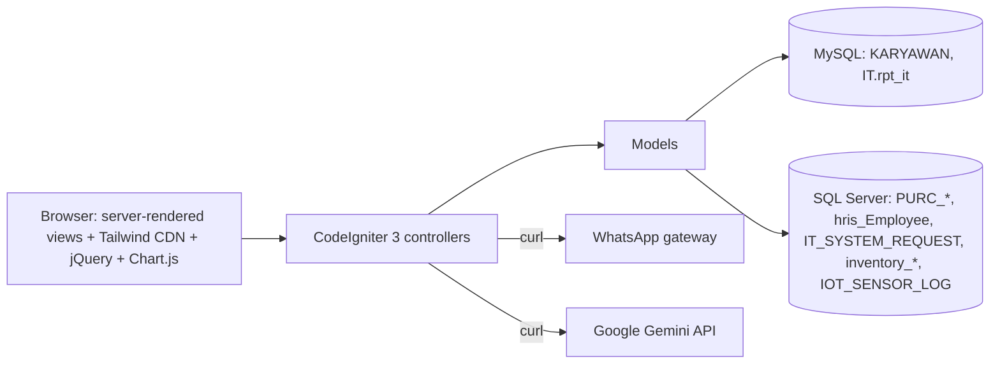

# ITSupport

> A multi-module IT operations platform (CodeIgniter 3) for helpdesk ticketing, IT
> system-request intake with AI assistance, IoT telemetry ingestion, and inventory
> lifecycle tracking (procurement → receiving → user handover) — backed by MySQL **and** SQL Server.

Built for the internal IT department of **Braja Mukti Cakra**, this legacy PHP application
was audited and hardened: secrets removed, dead code cleaned, verified bugs fixed, and
core business logic extracted into a testable library.

---

## Overview

ITSupport is a server-rendered PHP web application that consolidates four day-to-day IT
workflows into one system:

1. **Helpdesk** — staff report IT problems (with webcam photo or file attachment); the IT
   team is notified via WhatsApp with a per-ticket completion link.
2. **System Request** — a structured form for requesting new IT systems, with a **Google
   Gemini**–powered "Tanya AI" suggestion box and a reporting dashboard.
3. **Inventory Barang** — track IT goods from purchase request to partial receiving to
   handover to the requesting employee, with quantity-derived statuses and Excel export.
4. **IoT telemetry** — an HTTP JSON ingestion endpoint that persists device
   temperature/voltage/alarm readings.

---

## Engineering Highlights

- **Multi-module internal IT operations platform** — four distinct workflows behind a
  single CodeIgniter 3 deployment.
- **Dual-database integration** — MySQL (`default`) and SQL Server (PDO `sqlsrv`) queried
  in the same request lifecycle for procurement, HRIS, and helpdesk data.
- **Google Gemini integration** — AI-assisted problem→solution suggestions via the
  Generative Language API, with the credential externalized to config/environment.
- **WhatsApp gateway integration** — automated ticket notifications with completion
  links, fully configurable (URL + recipients) and gracefully disabled when unset.
- **Inventory lifecycle engine** — statuses are *derived* from received/handed-over
  quantities (not trusted flags), with over-receipt/over-handover validation guards.
- **HTTP-based IoT ingestion** — a validated JSON endpoint persisting device telemetry.
- **Dashboard & reporting** — Chart.js KPIs, monthly calling trends, per-programmer
  workload cards.
- **Testable core logic** — status/quantity business rules extracted into a
  dependency-free library covered by 28 automated assertions (`php tests/run.php`).
- **Security & hygiene pass** — hardcoded API credential removed, environment-specific
  values externalized, dead routes/views/functions cleaned, `imgSrc` JavaScript error
  fixed, and a verified `material_id`/`nama_barang` parameter bug corrected.

---

## Key Features

| Module | Highlights |
| --- | --- |
| **Dashboard** | Total / done / pending request KPIs · "Calling Per Month" bar chart · latest-requests table |
| **Helpdesk** | Employee form · webcam capture · file attachment · WhatsApp notification · public completion link · repair-type classification |
| **System Request** | Select2 HRIS employee search · multi-section spec form · AI solution + data-output suggestions · dark report dashboard · programmer busy-check · printable report |
| **Inventory** | PR-grouped table with expand/collapse & progress bars · status filters · partial **receiving** · employee **handover** · Excel export (.xlsx with dependency, .xls fallback) |
| **IoT API** | `POST /api/insert` with JSON validation → `IOT_SENSOR_LOG` |

---

## Core Workflows

### Helpdesk

```
Employee → form + photo → ticket saved → WhatsApp (with completion link) → IT team
         → PIC opens link → records solution → ticket marked done → dashboard updated
```

### Inventory lifecycle

```
PR (PURC_PURCHREQUEST_TEMP, dept/IT)
   → Penerimaan (partial receipts, validated ≤ PR qty)
   → Stock IT (received but not handed over)
   → Serah Terima (handed over to employee, validated ≤ received)
   → Effective status derived from quantities, recomputed on every edit/delete
```

### System request w/ AI

```
Requester problem text → ask_ai → Gemini suggestion (solution + data output)
   → copied into form → submit → IT_SYSTEM_REQUEST → report dashboard → assignment → print
```

---

## System Architecture



The full data-flow and endpoint details live in [docs/ARCHITECTURE.md](docs/ARCHITECTURE.md)
and [docs/API.md](docs/API.md).

---

## Technology Stack

| Layer | Technology |
| --- | --- |
| Language | PHP (CodeIgniter 3.1.13) |
| Frontend | Server-rendered views · Tailwind CSS (CDN) · jQuery · Select2 · DataTables · Chart.js · Webcam.js · SweetAlert2 |
| Database 1 | MySQL (`mysqli`) |
| Database 2 | Microsoft SQL Server (PDO `sqlsrv`) |
| Integrations | Google Gemini API · internal WhatsApp gateway |
| Export | PHPExcel (`.xlsx`, composer) with dependency-free `.xls` fallback |
| Tests | Standalone PHP assertions (`php tests/run.php`) |

---

## Project Scope

- **In scope today:** helpdesk ticketing, system-request intake + reporting, inventory
  receiving/handover tracking, IoT ingestion, dashboard KPIs.
- **Out of scope / not packaged:** authentication layer (all routes are public), IoT
  device firmware / MQTT, database migrations/DDL, CI/CD, Docker.
- **Compatibility note:** several tables are shared with existing corporate systems
  (procurement `PURC_*`, HRIS `hris_Employee`) and are read/joined, not owned by this
  application.

---

## Repository Structure

```text
ITSupport/
├── application/
│   ├── config/            # routes, database template, itsupport settings template
│   ├── controllers/       # Api, Bantuan, Dashboard, InventoryBarang, SystemRequest, terimaKasih
│   ├── libraries/         # Inventory_status (pure, testable business rules)
│   ├── models/            # Iot_model, InventoryBarang_model, M_dashboard
│   └── views/             # dashboard, bantuan/, SystemRequest/, inventory_barang/, templates/
├── assets/img/            # static images
├── docs/                  # ARCHITECTURE, API, AUDIT, images placeholder
├── system/                # CodeIgniter 3.1.13 core (unmodified)
└── tests/run.php          # standalone test runner
```

---

## Installation

### Prerequisites

- **PHP 5.6+** with extensions: `mysqli`, `pdo_sqlsrv` (SQL Server driver), `curl`, `json`, `mbstring`
- **Apache** with `mod_rewrite` (or Nginx rewrite equivalent)
- **Two databases:** MySQL + SQL Server, populated with the tables named in the code

> Node.js is not required — front-end libraries load from CDNs.

```bash
git clone https://github.com/HidayahMF/ITSupport.git
cd ITSupport

# 1) Database configuration (REQUIRED)
cp application/config/database.example.php application/config/database.php
#    edit database.php:  default  = MySQL connection
#                        sqlServer = SQL Server connection

# 2) Application settings (secrets / integrations)
cp application/config/itsupport.example.php application/config/itsupport.php
#    edit itsupport.php: GEMINI key (optional), WhatsApp gateway + recipients (optional)

# 3) Optional: composer deps for the .xlsx export
composer install

# 4) Serve the project root (Apache vhost) and set CI_ENV=production in production.
```

### Environment variables

CodeIgniter does not load `.env` natively; environment values are read with `getenv()`.
See [`.env.example`](.env.example) for the full list and set them via Apache `SetEnv`,
systemd, or the config files above.

| Variable | Purpose |
| --- | --- |
| `APP_BASE_URL` | Base URL (defaults to CodeIgniter auto-detect) |
| `GEMINI_API_KEY` | Gemini key for "Tanya AI" (leave empty to disable) |
| `GEMINI_MODEL` | Gemini model name |
| `WHATSAPP_GATEWAY_URL` | Gateway URL (leave empty to disable notifications) |
| `WHATSAPP_RECIPIENTS` | Comma-separated recipient numbers (international format) |

---

## Testing

No dependency-based test framework is required — pure business-rule tests run with plain
PHP (no database needed):

```bash
php tests/run.php
```

Covers the inventory module's core rules: effective-status derivation, progress,
remaining quantities, PR-group status collapsing, and the receiving/handover overrun
guards. Models/controllers that need live databases are out of scope for these tests.

---

## Security Considerations

The repository was hardened during the audit:

- A **previously hardcoded Google Gemini API credential was removed from the current
  source tree** (now config/env-driven). The original credential should be considered
  **compromised and rotated** — it still exists in earlier Git history.
- WhatsApp gateway URL + recipient numbers moved out of code into configuration
  (gitignored), with WhatsApp silently disabled when unset.
- cURL TLS verification is enabled for the Gemini calls.
- `application/config/database.php` and `application/config/itsupport.php` are gitignored.

**Remaining risks (documented honestly):** no authentication/authorization layer and CSRF
disabled — all endpoints are public; upload validation is minimal; verbose logging is
ON. See [docs/AUDIT.md](docs/AUDIT.md) for details and the prioritized roadmap.

---

## Known Limitations

- No login / roles / CSRF protection.
- No DB migrations/seeders shipped (schema is applied manually).
- Excel `.xlsx` export depends on the abandoned PHPExcel package; the `.xls` fallback
  covers missing dependencies.
- Inventory filtering is scoped to one department plus one PR-year suffix.
- Automated tests cover business rules only; DB-backed flows are untested.

Full verified findings: **[docs/AUDIT.md](docs/AUDIT.md)**

---

## Screenshots

Not available yet. Recommended captures (dashboard, helpdesk, system-request + AI,
inventory) are described in [docs/images/README.md](docs/images/README.md) — screenshots
will be added there as real captures, never fabricated.

---

## Documentation

- [Architecture](docs/ARCHITECTURE.md) — modules, data flow, database layout
- [API Reference](docs/API.md) — all endpoints and the IoT payload
- [Audit & Known Issues](docs/AUDIT.md) — verified findings and roadmap
- [Screenshots](docs/images/README.md) — placeholder with capture guidance

---

## Author & License

- Author: **Hidayah Muhammad Fadilah** (verified from Git history)
- Repository: `https://github.com/HidayahMF/ITSupport`
- Framework: CodeIgniter 3.1.13 (MIT). Application code carries no separate license
  declaration; `license.txt` is the CodeIgniter MIT license text.